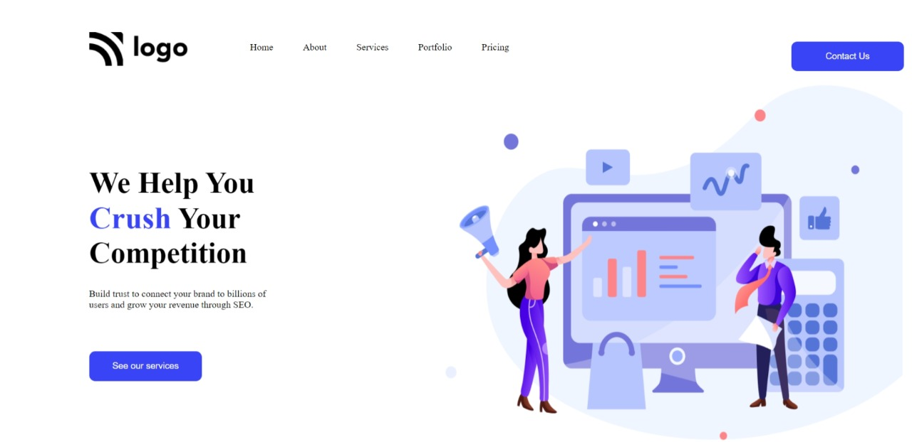

# Project-04-  A Small Web page
 ## Hey there ,  I am Amarjeet 
 I have build a template of HTML and CSS project using my core css skills 
 
 
 
 

 My Live Deployed Website Link :- [Click here !](https://app.netlify.com/sites/project-04-a-small-web-page/overview)

 
 

 ## For making this project I spend allmost 5 hour .

 ## What I learned from this project 
 - First of all I explore more about image adjustment on web page.
 - Then I learbed a little bit about hover effects .
